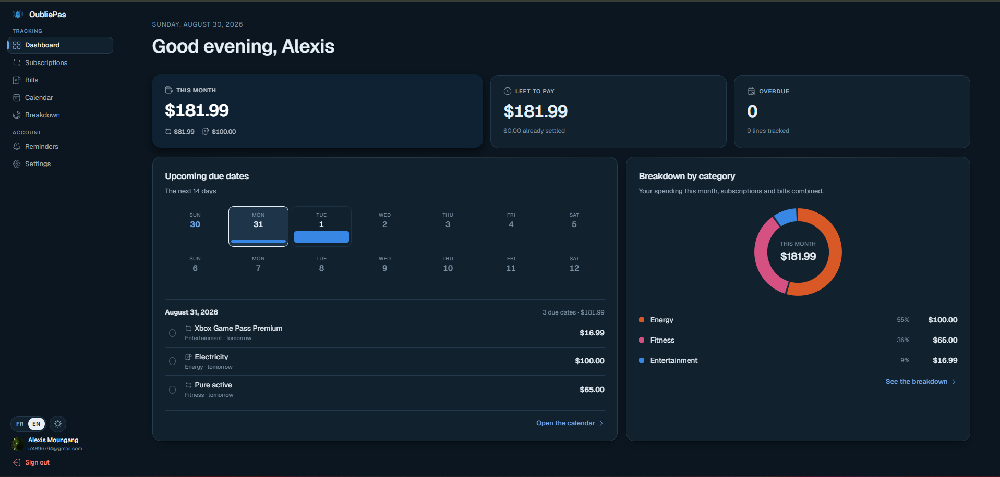
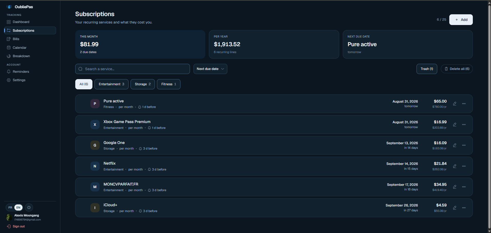
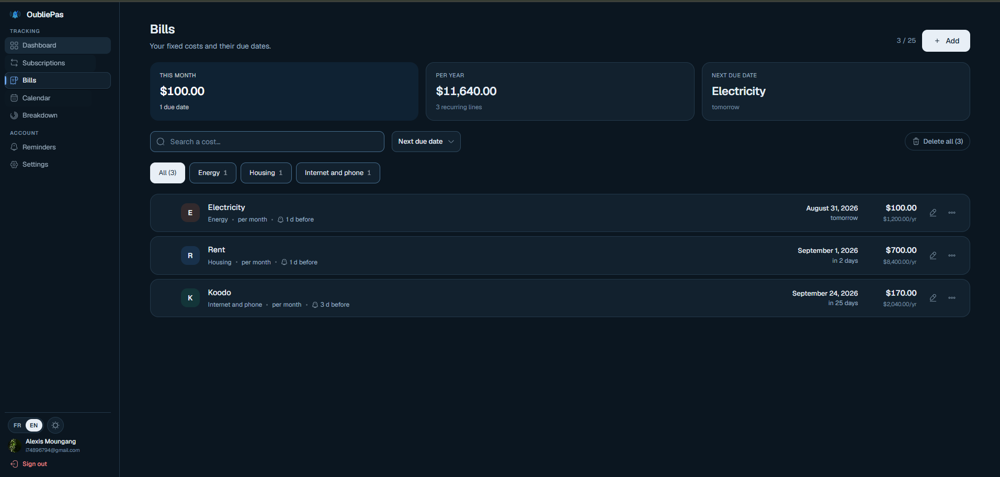
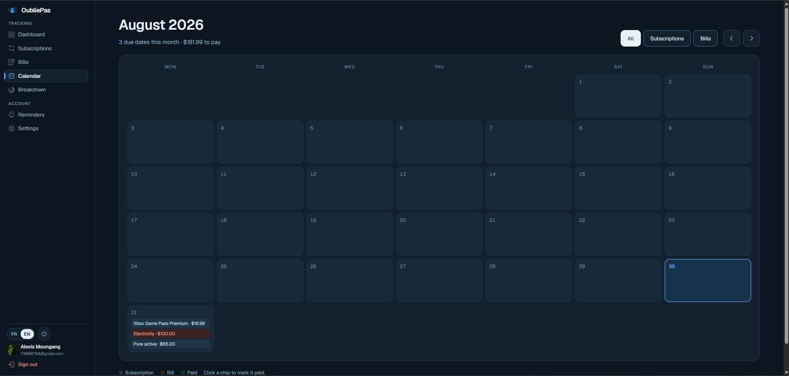
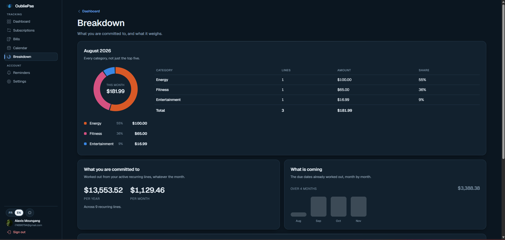
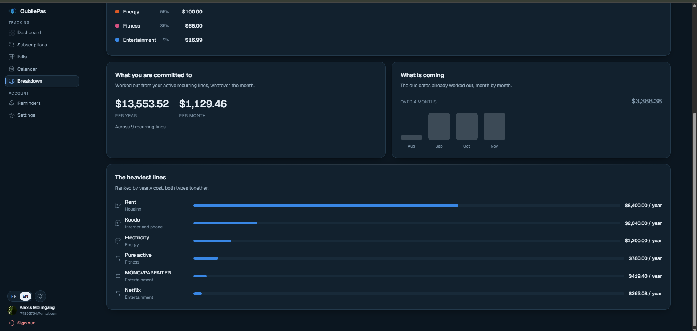
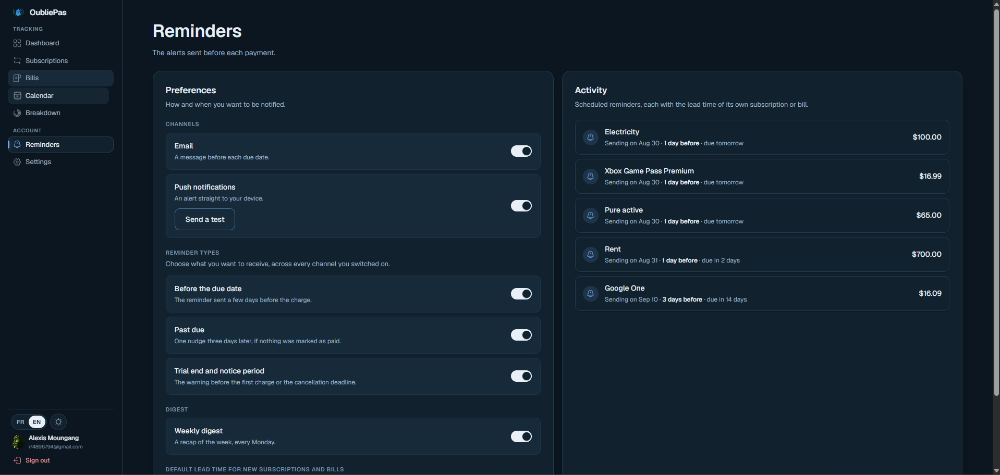
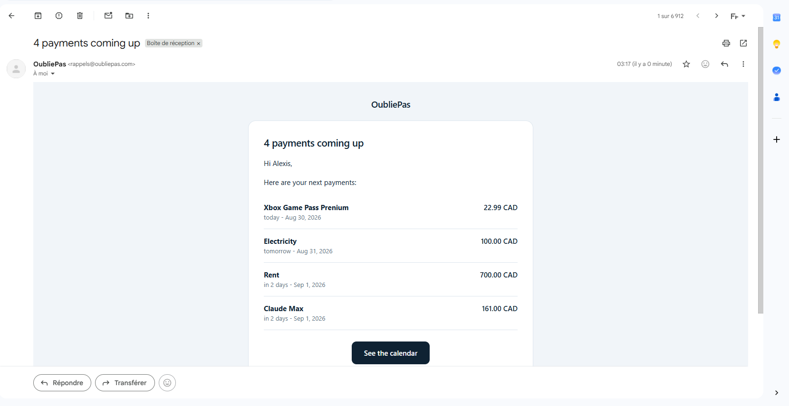
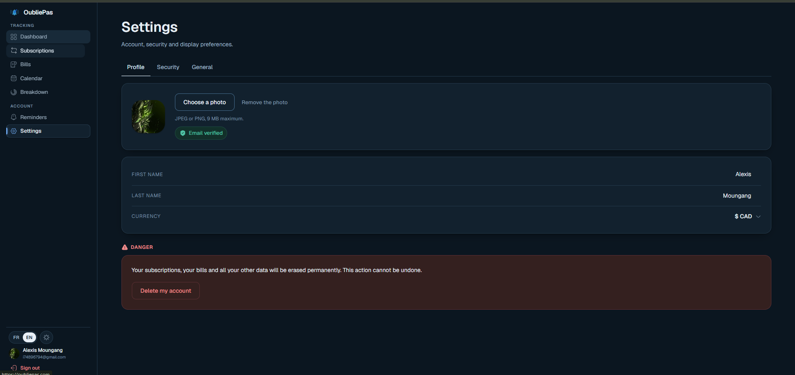

# OubliePas — web client

The React single-page app for OubliePas, a subscription and bill tracker. It talks
to the FastAPI backend that lives in the sibling `../backend` repository.

The app answers one question: **what am I paying for, and what is about to be
charged?** Everything else — the reminders, the calendar, the breakdown — exists
to keep that answer current without anyone having to go looking for it.

---

## What it looks like

### Dashboard

The month at a glance: what it costs, what is still owed, what is late. The
fourteen-day strip underneath marks the days that carry a due date, so a busy
week is visible before it arrives.



### Subscriptions and bills

Two lists, same shape, different meaning. A **subscription** is a recurring
service you signed up for; a **bill** is a fixed cost you owe anyway. Each row
carries its category, its cadence, its reminder lead time, its next due date and
both the per-charge and yearly amounts — because a $16.99 monthly line reads very
differently as $203.88 a year.

Accounts are capped at 25 of each type. The counter in the corner (`6 / 25`) says
where you stand; archiving a line frees a slot without losing its history.





### Calendar

The month as a grid, one chip per instalment, coloured by type — subscription,
bill, already paid. Clicking a chip marks it paid without leaving the page.

On a phone the grid keeps its seven columns but drops the text: a day becomes a
square with coloured dots, and tapping it opens that day's instalments in a panel
below the grid. The shape of the month stays readable at 390 px, and the detail is
one tap away.



### Breakdown

Where the money actually goes. Every category, not just the top five, with the
donut and the table saying the same thing two ways.



Below it, the two numbers that matter for a decision — what you are committed to
per year and per month across every active recurring line — and the heaviest lines
ranked by yearly cost, subscriptions and bills together. Rent at $8,400 a year and
Netflix at $262 belong on the same scale; that is the point of the ranking.



### Reminders

Three families of alert, each switchable on its own: **before the due date**,
**past due**, and **trial end or cancellation notice**. Two channels, email and
web push. One weekly digest, sent every Monday.

The right-hand column lists what is actually scheduled, each with the lead time of
its own subscription or bill — so a preference change is visible immediately
rather than at the next send.



The push switch reflects **both** the account setting and whether *this* device is
subscribed: the flag is global, the subscription is per browser, and showing only
the flag would promise notifications to a phone that will never receive one. The
*Send a test* button asks the API to push a real notification — proof that the
whole chain works, rather than a message this page could fake on its own.

Reminders arrive looking like this:



### Settings

Profile, security and display preferences, plus account deletion behind an
explicit danger zone.



---

## Stack

| | |
|---|---|
| Framework | React 19 |
| Build | Vite 8 |
| Routing | React Router 7 |
| Styling | CSS Modules — no Tailwind, no CSS-in-JS |
| Icons | `iconsax-react` |
| Font | Geist Variable |
| Tests | Vitest |

There is **no TypeScript**. There is **no UI component library** — the 30-odd
components in `src/core/components` are written for this app.

## Getting started

```bash
npm install
npm run dev
```

The dev server falls back to `http://localhost:8000` for the API, so a local
backend needs no configuration at all. To point somewhere else, copy
`.env.example` to `.env` and set `VITE_API_URL`.

**`VITE_API_URL` is read at build time, not at runtime.** Changing it after the
fact does nothing until you rebuild — which is exactly how a deployed site ends up
calling a laptop. A build guard (`vite.guards.js`) fails the build on a hosting
platform when the variable is missing, rather than shipping an app that would
query each visitor's own machine.

Everything prefixed `VITE_` is written into the bundle and is therefore public.
Never put a secret there.

## Scripts

```bash
npm run dev        # dev server with HMR
npm run build      # production build into dist/
npm run preview    # serve the built bundle locally
npm run lint       # ESLint
npm run test       # Vitest, single run
npm run test:watch # Vitest, watch mode
```

## Layout

```
src/
  core/            # shared across features
    components/    # buttons, dialogs, switches, pickers…
    network/       # HTTP client, error envelope, error messages
    pages/         # landing, FAQ, legal, 404
    theme/         # light and dark
    translation/   # fr and en dictionaries
    utils/
  features/
    authentication/
    commitments/   # subscriptions, bills, calendar, breakdown
    notifications/ # reminders, push
  tests/
```

Each feature follows the same split: `domain/` for pure logic, `data/` for API
calls, `presentation/` for pages, components and hooks. Domain code never imports
from presentation.

## Internationalisation

French and English, switchable from the sidebar. Every visible string lives in
`src/core/translation/dictionaries`, and two guard tests enforce it: one refuses a
hardcoded string in a spoken attribute (`aria-label`, `placeholder`, `alt`,
`title`), the other refuses a bare text node between two tags. A label written
straight into a component fails the suite.

The error dictionary carries its own rules — every message must name a next action
and say whether anything was saved.

## Tests

```bash
npm run test
```

349 tests across 23 files. The environment is **node, not jsdom**: nothing here
renders. Pure logic is tested directly, and hooks are tested by mocking the
`react` module itself and replaying effects by hand — the harness lives at the top
of `src/tests/unit/usePush.test.js` and is reused by the others.

Alongside the behavioural tests sit a few structural guards that read the source
as text: the layout rules that keep the sidebar footer reachable, the
no-hardcoded-string rules above, and the error-message doctrine.

The house rule is that a guard must prove it bites: reintroduce the defect it
prevents and watch a named test fail, before calling it a guard.

## Progressive web app

`public/sw.js` and `public/manifest.webmanifest` sit at the **root** on purpose. A
service worker's scope comes from its file's path — served from anywhere else it
would not see the pages it has to wake, and no notification would arrive. The
manifest declares `standalone`, without which adding the site to an iPhone home
screen opens a tab rather than an app, and Safari does not expose `PushManager`
inside a tab.

## Deployment

Deployed on Vercel from `main`. The only build variable is `VITE_API_URL`, which
must be the absolute address of the deployed API.

The backend repository carries a read-only end-to-end suite that checks this
deployment from the outside: that `sw.js` is served from the root, that the
manifest claims the whole site, and that the built bundle calls the deployed API
rather than `localhost`.
