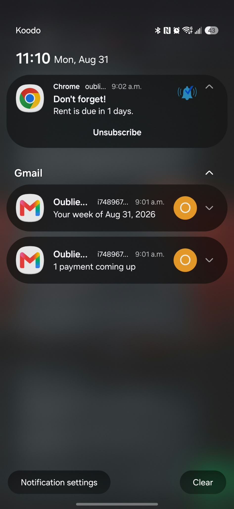

# OubliePas, the web client

React single-page app for a subscription and bill tracker. This repository is the
client; the FastAPI service lives in the sibling repository `../backend`.

A **commitment** is the recurring thing you track, a subscription or an invoice.
An **occurrence** is one dated instalment of it. The client lists them, draws the
month, breaks the spending down by category, and lets you switch reminders on per
family and per channel. It is bilingual, themed light and dark, and installable
as a progressive web app that stays readable offline.

## Contents

- [Requirements](#requirements)
- [Getting started](#getting-started)
- [Commands](#commands)
- [Configuration](#configuration)
- [What it looks like](#what-it-looks-like)
- [Architecture](#architecture)
- [Network layer](#network-layer)
- [State and caching](#state-and-caching)
- [Authentication](#authentication)
- [Routing](#routing)
- [The commitments feature](#the-commitments-feature)
- [Reminders and push](#reminders-and-push)
- [Time zones](#time-zones)
- [Internationalisation](#internationalisation)
- [Theme](#theme)
- [Components](#components)
- [Progressive web app](#progressive-web-app)
- [Tests](#tests)
- [Deployment](#deployment)
- [Traps that have already cost time](#traps-that-have-already-cost-time)

## Requirements

- Node, at the version Vite 8 asks for: 20.19 or newer, or 22.12 or newer.
- The API running somewhere reachable. In development that is usually
  `http://localhost:8000`, the backend's default port.

Nothing else. There is no CSS framework, no component library, no state manager
and no data-fetching library. Six runtime dependencies, ten development ones.

## Getting started

```bash
npm install
cp .env.example .env          # optional in development
npm run dev
```

The dev server runs on `http://localhost:5173`. Without `.env` the client falls
back to the deployed API, so the first run works with no configuration at all,
against production data. Point `VITE_API_URL` at your local backend to work
offline from it.

## Commands

```bash
npm run dev          # Vite dev server, hot reload
npm run build        # production bundle into dist/
npm run preview      # serve the built bundle, port 4173
npm run lint         # eslint, including the React compiler rules
npm run test         # vitest, one run
npm run test:watch   # vitest, watching
```

`npm run preview` serves the production build, so `import.meta.env.PROD` is true
and the service worker registers. It runs on a different port from the dev
server, which keeps the two from sharing a worker.

## Configuration

One variable, and it is read at **build** time, not at runtime:

```
VITE_API_URL=https://api.oubliepas.com
```

Everything prefixed `VITE_` is written into the bundle and is therefore public.
Never put a secret there.

`vite.guards.js` holds two checks that run during the build:

- An absolute address is required. A relative one throws.
- An address pointing at a local machine builds, but prints a warning. Building
  a bundle against your own machine is legitimate; mistaking it for a
  deliverable one is not.

The first version of that guard demanded `VITE_API_URL` as soon as any platform
variable was present. Vercel only exposes its own variables to the build when a
box is ticked in the settings, the guard never fired, and a bundle pointing at
`localhost` went to production. Environment detection was dropped in favour of a
source invariant, checked by a test: **the fallback in `apiConfig.js` never
points at a local machine.** A build with no variable is then harmless wherever
it runs.

## What it looks like

### Dashboard


The month total, what is left to pay, what is overdue, the next fourteen days,
and the category breakdown truncated to the five heaviest plus one line for the
rest.

### Subscriptions and bills


Same view, two meanings. Each line carries its category, its cadence, its own
reminder lead time and both the per-charge and the yearly amount.

### Calendar


On a phone the grid keeps its seven columns and drops the text. A day becomes a
square with coloured dots, and tapping it opens that day's instalments below the
grid. Seven columns of text are unreadable at 390 px; the shape of the month is
not.

### Breakdown


Every category, not just the top five, plus what you are committed to per year
and per month, and the heaviest lines ranked across both types together.

### Reminders


Three families of alert, each switchable on its own, over two channels, plus the
weekly digest.

### On the phone



A push notification carries the title, the line and how many days are left, and
never the amount. A locked screen is a public place.

## Architecture

```
core/        shared by every feature
features/    one folder per feature, three layers each
```

Each feature follows the same split:

```
domain/         pure logic, no React, no network
data/           API calls and endpoint constants
presentation/   pages, components, hooks, providers, styles
```

**Domain code never imports from presentation.** That is what makes it testable
in a node environment with no DOM, which is how the whole suite runs.

### The tree

```
index.html                 the shell, plus the inline script that sets the
                           theme before React mounts
vite.config.js             Vite, the React plugin, the build-time API guard
vite.guards.js             those guards, extracted so tests can call them
vitest.config.js           node environment, no jsdom
eslint.config.js           eslint plus the React compiler rules
vercel.json                rewrites and security headers
.env.example               the single variable, documented

src/
  main.jsx                 mounts React, nests the providers, registers the
                           service worker in production builds
  router.jsx               every route, and which layout guards it
  index.css                design tokens, resets, the light and dark palettes

  core/
    network/
      apiConfig.js         the base URL and its non-local fallback
      httpClient.js        fetch wrapper: timeouts, refresh on 401, retry once
      ApiError.js          the error shape the whole client switches on
      errorMessages.js     turns a code into a translated sentence
      tokenStorage.js      access token and session flag, cross-tab watch
      resourceCache.js     the shared cache, its generations, its subscribers
      useResource.js       reads a key, subscribes to it, revalidates
      healthApi.js         the unauthenticated probe
    pages/
      HomeRoute.jsx        picks the landing page or the dashboard
      LandingPage.jsx      the public page
      HomePage.jsx         the dashboard
      FaqPage.jsx          questions and answers, shared with the settings
      NotFoundPage.jsx     404
      ComingSoonPage.jsx   placeholder for a route not built yet
      RootLayout.jsx       the outlet every route hangs from
      legal/               terms and privacy, one file per language
    components/            the design system, one folder per component
    theme/                 light, dark, follow the system
    translation/           the two dictionaries and the translator
    pwa/
      platform.js          is this Apple, is this a standalone window
      install.js           the install state machine
      useInstallPrompt.js  captures beforeinstallprompt
      registerServiceWorker.js  registration and the update check
    utils/
      formatting.js        money, dates, months, percentages
      timezone.js          the account's day, and the catch-up rule
      useToday.js          today, in the account's zone
      classNames.js        conditional class joining
      useAsyncAction.js    pending, error and field errors for a submit
      useCooldown.js       the countdown on a resend button
      useDismiss.js        the closing animation of a popover
      useDocumentTitle.js  the tab title
      useLongPress.js      long press to start a selection
      useReturnFocus.js    gives focus back when a dialog closes
      useReveal.js         reveal on scroll, once
      useScrollLock.js     locks the body behind a modal
      useUnsavedChangesGuard.js  warns before leaving a dirty form
      avatarColor.js       a stable colour from a name
      greeting.js          good morning, good evening

  features/authentication/
    domain/user.js         maps the API payload to the client shape
    domain/validation.js   email and password rules, mirrored from the server
    domain/currencies.js   the list and its labels
    domain/googleOAuth.js  PKCE, state, the authorization URL
    domain/sessionNotices.js  why the session ended
    domain/avatar.js       accepted types and the size cap
    data/authApi.js        register, verify, login, Google, refresh, logout
    data/userApi.js        profile, avatar, password, email, deletion
    data/sessionBootstrap.js  wires the refresh handler into the http client
    presentation/providers/AuthProvider.jsx  the session, and the time-zone
                           catch-up at sign in
    presentation/components/  forms, settings sections, route guards
    presentation/pages/    login, register, verify, reset, callback, settings

  features/commitments/
    domain/commitment.js   types, categories, tints, the run rate, top
                           categories and the shared ordering
    domain/calendar.js     the month grid and its per-day dots
    domain/breakdown.js    the heaviest lines and the months ahead
    domain/catalog.js      the suggestion catalogue, with logos
    domain/formatting.js   re-exports the shared formatters
    data/commitmentsApi.js every call, and the summary cache key
    presentation/providers/  useCommitments, useOccurrences, useSettle
    presentation/hooks/useSelection.js  multi-select with a long press
    presentation/pages/    subscriptions, invoices, calendar, breakdown
    presentation/components/  rows, dialogs, charts, skeletons, the trash

  features/notifications/
    domain/push.js         browser support, permission, the iOS special case
    domain/reminders.js    families, channels, lead times, the activity feed
    data/pushApi.js        key, subscribe, unsubscribe, test
    presentation/hooks/usePush.js  permission, subscription, VAPID key match
    presentation/pages/RemindersPage.jsx

  tests/
    unit/                  pure logic and hooks, no rendering
    integration/           several modules together, still no DOM

public/
  sw.js                    the service worker: cache, offline, notifications
  manifest.webmanifest     the install manifest
  assets/                  icons, screenshots, brand logos for the catalogue
```

## Network layer

`httpClient.js` is a thin wrapper around `fetch`, and it carries four decisions.

**Timeouts.** 20 seconds for a normal request, 120 for an upload. A cut
connection rejects immediately anyway; the case this covers is a server that
accepts the connection and never answers, a container restarting or a proxy
hanging, where the promise would otherwise stay pending and the spinner turn
forever.

**One retry on an expired access token.** A 401 carrying `INVALID_ACCESS_TOKEN`
triggers a refresh and replays the request once. Any other error goes straight
up.

**One refresh at a time.** Ten components can hit a 401 in the same tick; the
in-flight refresh promise is shared, so the server sees one call and every caller
waits on the same result.

**A failed refresh ends the session.** Tokens are cleared and every listener
registered through `onSessionExpired` is told why, which is what puts a sentence
on the login screen instead of dropping the person somewhere with no explanation.

Errors always arrive as an `ApiError` carrying `status`, `code`, `fieldErrors`
and `details`. Nothing in the client reads an error message to decide what to
do; it switches on `code`. `errorMessages.js` turns a code into a translated
sentence, trying the type-suffixed key first (`errors.COMMITMENT_LIMIT_REACHED_INVOICE`)
and falling back to the plain one.

## State and caching

There is no state library. Server data lives in `resourceCache.js`, a module-level
`Map` keyed by a string, and `useResource` is the only way in.

```js
const { data, loading, error, revalidate, setData } = useResource(key, fetcher);
```

Three properties make it work:

**Generations.** `clearResources()` bumps a counter and empties the map. A
response that left before a sign out carries the old generation and is refused on
arrival, so account A's list cannot land in account B's session.

**Subscribers.** A write notifies every hook mounted on that key. The cache used
to be shared but silent: two components on the same key each kept their own copy
in a `useState`, and one writing never reached the other. The sidebar's overdue
badge kept its old count after a payment and only woke on navigation.

**One place per derived read.** The monthly breakdown is computed once, on the
server, and both the dashboard and the breakdown page consume that same summary.
Truncating to the top five is presentation, never a second calculation. The two
used to disagree, one bounded in UTC and the other counted in browser time, and
they showed different months for the same account at the same moment.

## Authentication

`AuthProvider` holds the session and exposes it through `useAuth`.

The access token lives in `localStorage`, the refresh token in an httpOnly cookie
the client never sees. A separate `oubliepas.session` flag says a session should
exist, which is what lets the app decide whether to try `GET /auth/me` on boot
rather than flashing the landing page first.

**Cross-tab.** `watchCrossTabChanges` listens on the storage event. Signing out
in one tab empties the others, cache included.

**The catch-up.** Accounts created before the time-zone column all sit at `UTC`.
At sign in, if the account is still at the default and the browser knows its own
zone, a silent PATCH sets it. A zone already chosen is never overwritten: a
laptop on a trip or a borrowed machine would otherwise replace a setting made by
hand, and nobody would know what to blame. A failed write does not block sign in,
because the catch-up is a convenience and not a condition.

**Google.** PKCE, with the verifier and the state kept in `sessionStorage` for
the round trip. The callback page exchanges them and opens the session like any
other.

## Routing

`createBrowserRouter`, so paths are real URLs. Three layers of layout:

| Layout | Guards |
|---|---|
| `RootLayout` | none, wraps everything, catches route errors with `CrashScreen` |
| `GuestLayout` | redirects an authenticated visitor away from login and register |
| `PrivateLayout` | requires a session, renders `AppShell` around the page |

| Path | Page |
|---|---|
| `/` | landing page, or the dashboard when signed in |
| `/connexion`, `/inscription` | sign in, sign up |
| `/verification` | the six-digit code |
| `/mot-de-passe-oublie`, `/reinitialisation` | password reset |
| `/auth/google/callback` | the OAuth round trip |
| `/abonnements`, `/factures` | the two kinds of commitment |
| `/calendrier` | the month |
| `/repartition` | the breakdown |
| `/rappels` | reminders and push |
| `/reglages` | profile, security, general |
| `/faq`, `/conditions`, `/confidentialite` | public pages |
| `*` | 404 |

Paths are in French because the product is. Renaming them would break every
bookmark for no gain.

## The commitments feature

**Two kinds, one shape.** A subscription is a recurring service, an invoice a
fixed cost owed anyway. Same fields, different wording, down to the reminder
text.

**The list** supports search, sorting, multi-select through a long press, and
batch actions on the selection. Deleting goes to the trash, which shows an undo
bar for a few seconds and keeps the lines for thirty days.

**The form** suggests known services from a catalogue of 115 entries, most
of them with their logo, so the common case is three taps rather than six fields.

**The calendar** draws the month from the occurrences alone. Each day carries up
to three coloured dots, one per category, and a fourth position means more.
Tapping a day opens its instalments underneath, where marking one paid opens the
settle dialog.

**The settle dialog** asks for the amount actually paid and the date, defaulting
to today and refusing a future one. Every settlement goes through `useSettle`,
which is also where the monthly summary is refreshed, so no screen can forget it.

**Colours are stable per category.** `assignTints` gives each category its
preferred slot and falls back to a neutral one when the slot is taken, so the
same category keeps the same colour between the donut, the legend and the
calendar dots.

## Reminders and push

Three families, each with its own switch: before the due date, past due, and
trial or cancellation deadlines. Two channels, email and push, each with its own
switch. Plus the weekly digest, which is email only, because offering it with
the email channel off would promise a send with no way out.

The activity feed on the reminders page is computed on the client from the
occurrences and the commitments, and shows what will be sent in the next sixty
days.

**Push** is web push, over the browser's own APIs.

`usePush` walks the states in a deliberate order. Safari does not expose
`PushManager` on an iPhone until the app is added to the home screen, so the
Apple check comes **before** the support check. The other order would tell
somebody whose browser can do it that their browser cannot, and hide the one
gesture that unblocks them.

An iPad has reported itself as a Macintosh since iPadOS 13. Only the number of
touch points separates it from a real Mac, which can receive push.

The subscription payload is copied field by field rather than sent as the
browser's `toJSON`, which carries an `expirationTime` the API refuses. That
refusal would land after the browser had already granted permission, which is the
worst possible moment.

A subscription stays valid for the public key that created it. If the server's
VAPID pair changed, the push service would reject every send with a 403 nobody
would see, so `keyMatches` compares the stored key and re-subscribes when it
differs.

## Time zones

The account's zone decides what day it is, everywhere in the client.

`Intl.DateTimeFormat().resolvedOptions().timeZone` goes out with the account at
sign up. The browser is the only one that knows it for sure; the server could
only deduce it from an IP address, and deduce it wrong.

`useToday()` reads the zone from the session rather than taking it as a
parameter in seven places, the same way the server binds it once per request.
There is one definition of today in the whole app, and it is the day of the
person looking, not the day of their machine.

The dashboard's date line and the cards underneath now land on that same day.
They used to disagree: a capture from 31 August showed **MONDAY, AUGUST 31**
above September's total, one reading the browser clock and the other a summary
computed elsewhere.

## Internationalisation

French and English, switchable from the sidebar and from the settings. Every
visible string lives in `src/core/translation/dictionaries`.

The translator handles nested keys, `{placeholder}` interpolation and plurals
through `Intl.PluralRules`, including exact forms written as `=0` and `=1`.

**Three guards keep it honest.** One refuses a hardcoded string in a spoken
attribute (`aria-label`, `placeholder`, `alt`, `title`). One refuses a bare text
node between two tags, which is where four button labels had been hiding in
French, outside the dictionary. The third checks that both dictionaries answer
for every key the other has.

The error dictionary carries its own doctrine, enforced by
`errorDoctrine.test.js`: every message that follows a **write** must say what
became of the data, and every message must name a next action. Messages that
follow a read or a refused sign in must promise nothing, because nothing was at
stake.

## Theme

Light, dark, or follow the system, kept in `localStorage`.

The choice is applied by an **inline script in `index.html`**, before React
mounts. Without it, a dark-mode visitor gets a white flash on every cold load,
and no amount of CSS fixes it after the fact.

`index.css` holds the tokens. Both palettes are defined there, and components
only ever reference variables.

## Components

Thirty, one folder each, CSS Modules alongside. No library.

Notable behaviour rather than a catalogue:

- **Picker** is a listbox with typeahead, and flips upward when there is no room
  below. The time-zone setting uses it for its 418 entries.
- **CodeInput** takes one digit per box, handles paste across the boxes, and
  moves focus on delete.
- **ConfirmDialog** returns focus to whatever opened it, locks the body scroll,
  and closes on Escape.
- **Toast** stacks, dismisses on its own, and survives a route change.
- **UndoBar** is the second half of soft delete, a few seconds to change your
  mind before the list settles.
- **Skeletons** exist per view rather than as one generic block, so the layout
  does not jump when data lands.
- **ErrorBoundary** wraps every provider, so `CrashScreen` can render when it is
  a provider that threw. That screen reads the French dictionary directly and
  calls no context, which is exactly what makes it able to appear at all.

## Progressive web app

The app installs, runs in its own window and stays readable offline.

`public/sw.js` and `public/manifest.webmanifest` sit at the **root** on purpose.
A service worker's scope comes from its file's path; served from anywhere else it
would not see the pages it has to wake, and no notification would arrive. The
manifest declares `standalone`, without which adding the site to an iPhone home
screen opens a tab rather than an app, and Safari does not expose `PushManager`
inside a tab.

### The worker

Registered from `main.jsx` on every production visit, not only when somebody
turns push on. Until it was, a visitor who never touched notifications had no
worker at all: nothing offline, and no install prompt, because Chrome only
offers to install a site whose worker declares a `fetch` handler.

| Request | Strategy |
|---|---|
| navigation | network first, cached shell as the offline fallback |
| `/assets/*` | cache first, since Vite fingerprints these names |
| anything else | passed straight through |

A cross-origin request never enters the cache, and neither does a `POST`. The
API lives on another domain, so the origin test alone keeps a stale amount from
being re-served with confidence.

### Two lines that look removable

**Navigation is network first, and must stay that way.** Serving the cached
shell first is the usual recipe, and it costs a reload: one to wake the new
worker, one more to finally see the new version. With the network first, a tester
who had the app open during a deployment sees it after a single reload.

**`Math.max(0, keys.length - MAX_ASSETS)` in `trim`.** A negative end makes
`slice` count from the end of the array. Without the floor, the asset cache
emptied itself from the head as soon as it passed half its bound.

The cache version is bumped by hand and deliberately not on every deploy: the
names are fingerprinted, so nothing goes stale, and purging on each release would
delete the lazy chunks a page already open still needs.

### Installing

`core/pwa/` holds the state machine. Chrome's `beforeinstallprompt` is captured
and relayed as a button in **Settings, General**. Safari never fires it, so an
iPhone gets the Share then *Add to Home Screen* gesture written out instead,
which is the same gesture that unlocks push there.

## Tests

```bash
npm run test
```

446 tests across 28 files. The environment is **node, not jsdom**: nothing here
renders.

Pure logic is tested directly. Hooks are tested by mocking the `react` module
itself and replaying effects by hand; the harness lives at the top of
`usePush.test.js` and is reused by the others. `useResource.test.js` carries a
larger one that honours dependency arrays, because it mounts two instances of
the same hook on one key and the whole point is that an effect must not replay.

Alongside the behavioural tests sit structural guards that read the source as
text: the no-hardcoded-string rules, the error-message doctrine, the deployment
invariants (the API fallback, the Vercel rewrites, the manifest), and the
one-source rule for the category breakdown.

`serviceWorker.test.js` runs `public/sw.js` for real, in a `node:vm` sandbox
where only the network and the cache are faked. That is how the `slice` defect
above was found, before it ever shipped.

The house rule is that a guard must prove it bites: reintroduce the defect it
prevents and watch a named test fail, before calling it a guard.

End-to-end coverage lives in the backend repository, which checks this
deployment from the outside rather than from a browser here.

## Deployment

Deployed on Vercel from `main`. The only build variable is `VITE_API_URL`, which
must be the absolute address of the deployed API.

`vercel.json` carries two things:

**A rewrite of every path to `index.html`.** Without it, reloading
`/abonnements` returns a 404, because the router builds real URLs.

**Security headers**, and deliberately **no `Cache-Control`.** The files under
`public/assets/` carry no fingerprint, and an immutable rule there would keep the
old logo for a year. A test asserts that no cache rule ever appears in that file.

The backend repository carries a read-only end-to-end suite that checks this
deployment from the outside: that `sw.js` is served from the root and declares
the `fetch` handler that makes the app installable, that the manifest claims the
whole site and carries a maskable icon, and that the built bundle calls the
deployed API rather than a laptop.

## Traps that have already cost time

**A bundle pointing at `localhost` reached production.** The build guard demanded
`VITE_API_URL` only when a platform variable was present, and Vercel does not
expose those unless a box is ticked. Environment detection is gone; the invariant
is now that the fallback in `apiConfig.js` is never a local address, and a test
holds it.

**`overflow-y: auto` alone turns on horizontal scrolling.** The spec forbids
mixing `visible` with a scrolling value, so the browser silently promotes the
other axis to `auto`. The sidebar grew a horizontal scrollbar nobody asked for.
`overflow-x: clip` is the fix, and it is load-bearing.

**`flex: 1` is `flex-basis: 0%`.** Items crush instead of wrapping. On the
commitment rows at 390 px the amount slid under the title until the basis was
set to `auto`.

**A preference written to the table, the migration and both schemas but not to
the server's response builder returns the default forever.** The write succeeds,
the read lies, and the switch falls back under your finger with no error
anywhere. It happened with the weekly digest. The guard lives in the backend
repository and now walks every writable field, not just the ones prefixed
`reminder_`.

**The shared cache was silent.** Two components on one key each kept their own
copy, and one writing never reached the other. Every derived read now has one
source and one notification.

**Two charts disagreed about the month.** The dashboard read a summary bounded in
UTC while the breakdown counted in browser time. At 22:10 Atlantic on 31 August
it was already 1 September in Greenwich, and the two pages were each right about
a different month. The breakdown no longer computes anything; it consumes the
same summary.
